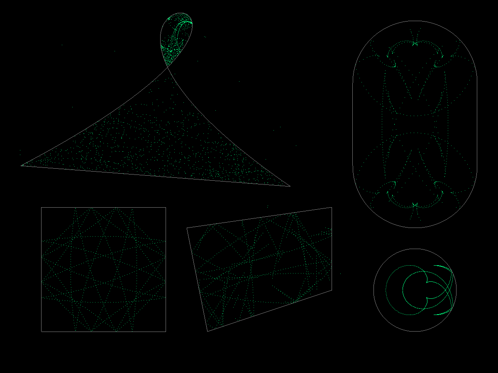
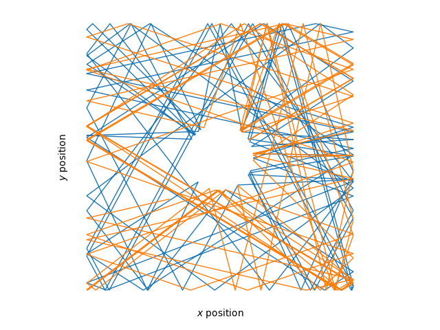
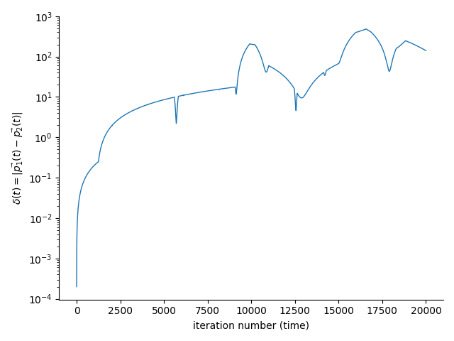

# Chaotic billiard demo

A chaotic billiard simulator written in C++, with Python bindings for data analysis.

Features
- `dt`-agnostic collision resolution (can resolve multiple collisions per frame)
- supports arbitrary parametrized mathematical curves (currently implemented : `Line`, `Segment`, `Arc`, `BezierCurve`)
- OpenGL renderer (via SFML) and headless rendering
- Python bindings to perform data analysis while using the performance of C++

[](https://www.youtube.com/watch?v=G_yAgBOhJOE&list=PLbdJZHRJVb0fmdZQhT87H0tJvsRJSCuWR&index=1)
[See the a demo https://www.youtube.com/watch?v=G_yAgBOhJOE&list=PLbdJZHRJVb0fmdZQhT87H0tJvsRJSCuWR&index=1](https://www.youtube.com/watch?v=G_yAgBOhJOE&list=PLbdJZHRJVb0fmdZQhT87H0tJvsRJSCuWR&index=1)

## Building the C++ source

Prerequisite : `cmake` and `SFML` (for the gui)

```sh
cmake -S. -Bbuild
cmake --build ./build --target physics gui
```

## Running the C++ GUI

```
$ ./build/gui/gui --help
Usage: chaotic billiard [options] worldfile 

Positional arguments:
worldfile       	.json file containing world information

Optional arguments:
-h --help       	shows help message and exits
-v --version    	prints version information and exits
--window        	display a render window [default: false]
--render        	render to file (not recommended when --window is used) [default: false]
--adaptative-dt 	use a flexible dt determined by framerate [default: false]
--duration      	duration of the simulation [default: 100]
--nsamples      	number of steps the simulation has to undergo [default: 100]
```

Load a worldfile and show the rendering window with adaptative timestep

```
./build/gui/gui worldfiles/world_circle.json --adaptative-dt --window
```

Render individual frames (n=100 frames, total duration=1000) (requires `ffmpeg` to stitch frames together)

```
mkdir -p frames render
./build/gui/gui worldfiles/world_circle.json --render --duration 1000 --nsamples 100
ffmpeg -framerate 30 -i frames/frame%d.png -c:v libx264 -r 30 -pix_fmt yuv420p render/world_circle.mp4
rm -r frames
```

## Custom world files

Uncomment the `export_world_json.cpp` target executable from `gui/CMakeLists.txt`, build and run.

Alternatively this could also be done in Python, using the bindings.

## Python bindings

Using `pybind11`, it is possible to use C++ for the simulation, and use the results directly in Python for data analysis.

### Building steps

Prerequisite : install the pybind11 `smart_holder` branch ([see also this demo for instructions](https://github.com/ninivert/pybind11-smart-holder-demo))

```sh
cd pychaotic_billiard
make build
```

### Run a demo

Prerequisites : `pyglet`, `numpy`

Launch a demo with all the curves (Segment, Arc, Bezier)

```sh
python demo.py
```

Launch a demo from a world file

```sh
python demo.py ../worldfiles/world_circle3.json
```

Other demos
- `demo_from_worldfile` : demonstrates loading a World from a world file
- `demo_to_worldfile` : demonstrates saving a World state, generated in Python


### Computing a Lyapunov exponent

One example is tracking the distance of two balls as a function of time, which can be use to compute the Lyapunov exponent of the system. See [`pychaotic_billiard/demo_lyapunov.py`](pychaotic_billiard/demo_lyapunov.py)

```python
world = World()
angle0 = 0.02
delta0 = 0.001

world.add_curve(Segment(vec2(50, 50), vec2(450, 50)))
world.add_curve(Segment(vec2(450, 50), vec2(450, 450)))
world.add_curve(Segment(vec2(450, 450), vec2(50, 450)))
world.add_curve(Segment(vec2(50, 450), vec2(50, 50)))
world.add_curve(Arc(vec2(250, 250), 50, 0, 2*np.pi))
world.add_ball(Ball(vec2(350, 250), vec2(np.cos(angle0-delta0/2), np.sin(angle0-delta0/2))))
world.add_ball(Ball(vec2(350, 250), vec2(np.cos(angle0+delta0/2), np.sin(angle0+delta0/2))))

nsteps = 100_000
nballs = len(world.balls)
pos = np.empty((nsteps, nballs, 2))
for i in range(nsteps):
	world.step(0.2)
	for j in range(nballs):
		pos[i, j, 0] = world.get_ball(j).pos.x
		pos[i, j, 1] = world.get_ball(j).pos.y

fig, ax = plt.subplots()
# ...
for j in range(pos.shape[1]):
	ax.plot(pos[:, j, 0].T, pos[:, j, 1].T)

fig, ax = plt.subplots()
# ...
ax.plot(np.linalg.norm(pos[:20_000, 0, :] - pos[:20_000, 1, :], axis=-1))

plt.show()
```





### Testing bindings

```sh
$ python test_segment.py
>>> initializing segments
Segment(p1=(-1.000000, 0.000000), p2=(1.000000, 0.000000))
Segment(p1=(0.000000, -1.000000), p2=(0.000000, 1.000000))
>>> casting to Line
Line(p=-0.000000, q=2.000000, r=0.000000)
Line(p=-2.000000, q=0.000000, r=-0.000000)
>>> testing coefs
OK
>>> intersecting
collision at [ParamPair(t1=0.500000, t2=0.500000)]
to points (0.000000, 0.000000) (0.000000, 0.000000)
OK
```

```sh
$ python test_world.py
>>> initial world
Balls:
	Ball(pos=(-1.000000, 1.000000), vel=(2.000000, 1.000000))
	Ball(pos=(0.000000, 1.000000), vel=(2.000000, 1.000000))
Curves:
	Segment(p1=(2.000000, 1.000000), p2=(2.000000, 4.000000))
	Segment(p1=(1.000000, 2.000000), p2=(4.000000, 2.000000))
>>> stepping
Balls:
	Ball(pos=(-15.000000, -7.000000), vel=(-2.000000, -1.000000))
	Ball(pos=(-16.000000, -7.000000), vel=(-2.000000, -1.000000))
Curves:
	Segment(p1=(2.000000, 1.000000), p2=(2.000000, 4.000000))
	Segment(p1=(1.000000, 2.000000), p2=(4.000000, 2.000000))
OK
```

## TODO

- bugfixes
  - [ ] fix collisions with BezierCurve (probably a problem with the third degree polynomial root solver)
- code improvements
  - [ ] put the physics in a namespace
  - [ ] move json out of physics library (serializer class)
  - [ ] build the python bindings with cmake
- features
  - [ ] ellipse implementation
  - [ ] python world generator
  - [ ] python level editor
  - [ ] trajectory heatmap
  - [ ] maze world https://twitter.com/matthen2/status/1440443280827699206?s=1